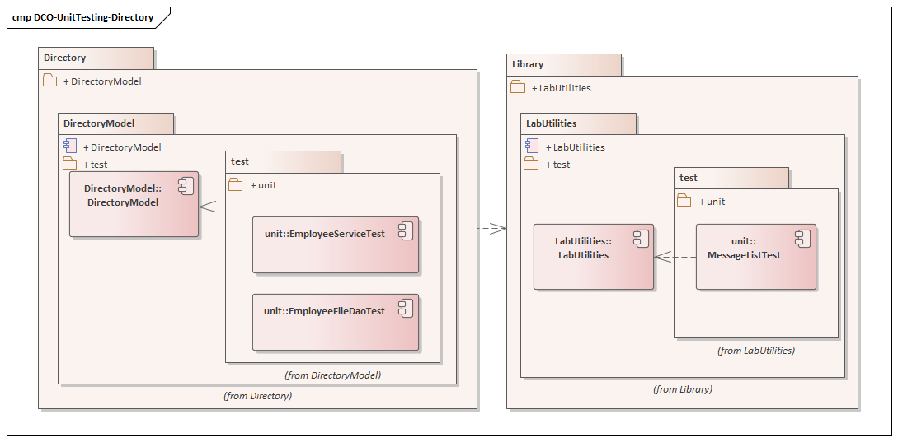

# Unit testing Workshop

To compile the code could use Qt Creator and load the c-labs.pro. To compile the code using shell we could use:

        mkdir ../installroot
        export INSTALL_ROOT=../installroot
        qmake && make && make check && make install

It's important create the installroot folder and set the INSTALL_ROOT environment variable.
In the common compilation command we add make to compile the Unit test too, because the Unit test doesn't compile with **make install**.

## Using QT Creator
Open Qt Creator and open the project c-labs.pro and after the project loads select the Projects button on the left panel. When the Qt Creator opens the Build settings panel un-check the option Shadow build.

### Run unit tests
To run the Unit Tests click o Tool Menu -> Tests -> Run all tests

## Git repository
The code in the repository uses almost two branches:
* **master**: that contains the exercise but the branch is closed
* **solution**: branch with the unit test code.

### Change between branches 

To download the ''solution'' branch we could use:

        git checkout -b solution --track origin/solution

To check the current branch

        git branch

To change between branches for example from solution to master

        git checkout master

To create a local commit

        git add -A # We wish to add everything
        git commit -m "Message for commit"

## Lab scenario
This Lab helps to create unit testing using C++ with Qt Framework. The code used to test is only for learning, it could be better.

### Components
The componentes for Unit test Workshop are represented in the following diagram:

* **LabUtilies**: Utility classes for the project and unit test
* **DirectoryModel**: Contains the structures and data access objects
* **DirectoryUi**: It will have an GUI application that uses the structures and data access, and services.

